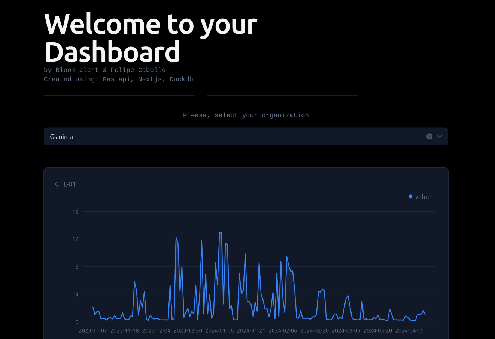

# Welcome to BloomAlertHomework

This is a fullstack project created for BloomAlert. It uses mainly open source tecnologies such as:
- Fastapi as backend
- Duckdb as a database
- Nextjs and react as a front end.

It is a Dashboard app that ingest data from a database and showcases timeseries mesurements.

## Project structure

**00docs** <- Contains the instructions for the creation of this proyect

**01data** <- Contains both the original (raw) and ingested data by duckdb (interim), it also contains some exploratory data analysis using both pandas and duckdb.

**02backend** <- Contains the requirements for deploying the backend and the necesary packages for performing the exploratory data anlysis.

**03Frontend** <- Contains the NextJS code necesary for deploying the frontend.

## Usage

Just select one of the two organizations and examine the data.

# Getting started

If you want to run this proyect you need:

- Python3 (Here I used Python 3.12.2)
- NextJS 14

The project was tested using a Fedora Linux 39.20240418 machine(Bluefin-dx)

# Next steps

There is a long list of tasks to improve the quality of this proyect.

Some of the more pressing ones are:

- Incorporate both unit and integrated testing.
- Containerize the app (Preferably composing it into three containers: Front-end, Back-end, Database).
- Apply continuous integration and continuous development.
- Incorporate additional metrics that are exposed by the api but not shown in the frontend.

# The data

The data is separated into two files, one represents the timeseries data and the other the organization details.

### timeseries_dataset.csv

**timestamp** (TIMESTAMP): Estampa horaria que representa el dato (UTC-0).

**variable** (STRING): Id de la variable medida.

**organization** (STRING): organización a la que corresponde el dato.

**value** (FLOAT): valor medido de la variable en la estampa horaria.

**ingestion_time** (TIMESTAMP): Estampa horaria que representa día en que se ingesto el dato a las bases de datos internas de Bloom Alert.

### organization_and_zones_dataset.csv
**organization** (STRING): organización a la que corresponde el dato.

**zone_id** (INTEGER): id único de una zona.

**polygon_decoded** (STRING): Este campo es especial, ya que si bien es un STRING, corresponde a un arreglo de puntos geográficos que dan origen a un polígono en el espacio. 

